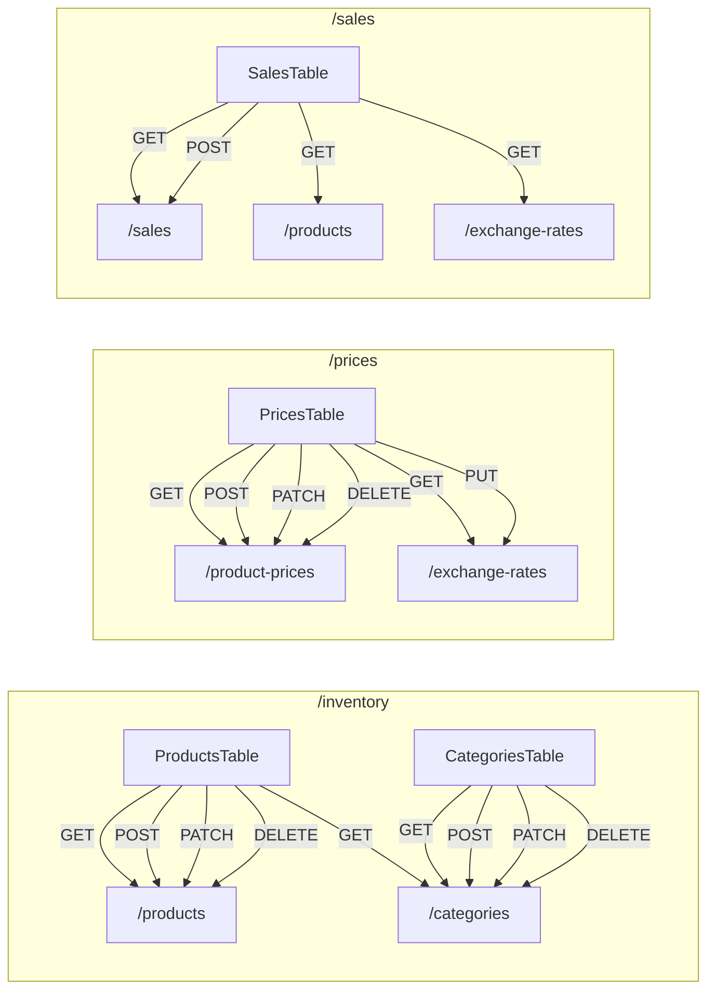

# 🗺️ Mapa de Endpoints — Invenda API

---

## Interfaces / Contratos de Datos

Estas son las estructuras exactas que el frontend espera recibir y enviar:

```typescript
interface Category {
    id: string;
    name: string;
}

interface Prices {
    usdTarjeta: number;
    usdFisico: number;
    cop: number;
    ves: number;
    exchangeType: "usd" | "cop";
    isCustomVes?: boolean;
}

interface Product {
    id: string;
    name: string;
    status: 1 | 2;        // 1 = Activo, 2 = Inactivo
    categoryId: string;
    stock: number;
    prices: Prices;
}

interface ExchangeRates {
    cop: number;           // Factor COP → VES (legacy, fallback)
    bcv: number;           // Bs por 1 USD
    copUsd: number;        // COP por 1 USD Físico (ej: 3754)
}

interface SaleItem {
    productId: string;
    quantity: number;
    unitPrice: Prices;
    totalPrice: Prices;
    payments: {
        usdFisico: number;
        usdTarjeta: number;
        cop: number;
        ves: number;
    };
}

interface Sale {
    id: string;
    date: string;          // ISO 8601
    items: SaleItem[];
    receivedTotals: {
        usdFisico: number;
        usdTarjeta: number;
        cop: number;
        ves: number;
    };
    status: "pagado" | "fiado" | "debiendo";
}
```

---

## 1. Categories

> Consumido por: **Inventory** ([categories-table.tsx](file:///home/abstem/Documents/dev/invenda/components/inventory/categories-table.tsx), [products-table.tsx](file:///home/abstem/Documents/dev/invenda/components/inventory/products-table.tsx)) y **Prices** ([prices-table.tsx](file:///home/abstem/Documents/dev/invenda/components/prices/prices-table.tsx))

| Método | Ruta | Request Body | Response | Notas |
|--------|------|-------------|----------|-------|
| `GET` | `/categories` | — | `Category[]` | Lista todas las categorías |
| `POST` | `/categories` | `{ name: string }` | [Category](file:///home/abstem/Documents/dev/invenda/lib/services/api.ts#4-8) | Devuelve la categoría creada con `id` generado |
| `PATCH` | `/categories/:id` | `{ name: string }` | [Category](file:///home/abstem/Documents/dev/invenda/lib/services/api.ts#4-8) | Actualiza solo el nombre |
| `DELETE` | `/categories/:id` | — | `void` (204) | Elimina la categoría |

---

## 2. Products

> Consumido por: **Inventory** ([products-table.tsx](file:///home/abstem/Documents/dev/invenda/components/inventory/products-table.tsx)), **Prices** ([prices-table.tsx](file:///home/abstem/Documents/dev/invenda/components/prices/prices-table.tsx)) y **Sales** ([sales-table.tsx](file:///home/abstem/Documents/dev/invenda/components/sales/sales-table.tsx))

| Método | Ruta | Request Body | Response | Notas |
|--------|------|-------------|----------|-------|
| `GET` | `/products` | — | `Product[]` | Lista todos los productos con sus precios |
| `POST` | `/products` | `CreateProductDto` (ver abajo) | [Product](file:///home/abstem/Documents/dev/invenda/lib/services/api.ts#24-32) | Devuelve el producto creado con `id` generado |
| `PATCH` | `/products/:id` | `Partial<Product>` | [Product](file:///home/abstem/Documents/dev/invenda/lib/services/api.ts#24-32) | Actualización parcial (nombre, stock, status, categoryId) |
| `DELETE` | `/products/:id` | — | `void` (204) | Elimina el producto |
| `PATCH` | `/products/:id/prices` | [Prices](file:///home/abstem/Documents/dev/invenda/lib/services/api.ts#15-23) | [Product](file:///home/abstem/Documents/dev/invenda/lib/services/api.ts#24-32) | Actualiza solo los precios del producto |

### CreateProductDto

```typescript
{
    name: string;
    categoryId: string;
    stock: number;
    status: 1 | 2;
    prices: Prices;  // Inicialmente { usdTarjeta: 0, usdFisico: 0, cop: 0, ves: 0, exchangeType: "usd" }
}
```

### Notas sobre PATCH `/products/:id`

El frontend envía actualizaciones parciales. Los campos que puede enviar:

```typescript
{
    name?: string;
    categoryId?: string;
    stock?: number;
    status?: 1 | 2;
}
```

> [!IMPORTANT]
> El status se envía como **número** (`1` o `2`), no como string.

---

## 3. Product Prices

> Consumido por: **Prices** ([prices-table.tsx](file:///home/abstem/Documents/dev/invenda/components/prices/prices-table.tsx))

| Método | Ruta | Request Body | Response | Notas |
|--------|------|-------------|----------|-------|
| `GET` | `/product-prices` | — | `ProductPrice[]` | Lista todos los precios con info del producto |
| `GET` | `/product-prices/:productId` | — | `ProductPrice` | Precio de un producto específico |
| `POST` | `/product-prices` | `CreateProductPriceDto` | `ProductPrice` | Crea precio para producto sin precio |
| `PATCH` | `/product-prices/:productId` | `Partial<PriceFields>` | `ProductPrice` | Actualiza precio existente |
| `DELETE` | `/product-prices/:productId` | — | `void` (204) | Elimina registro de precio |

### CreateProductPriceDto

```typescript
{
    productId: string;
    usdTarjeta: number;
    usdFisico: number;
    cop: number;
    ves: number;
    exchangeType: "usd" | "cop";
    isCustomUsdTarjeta?: boolean;
    isCustomUsdFisico?: boolean;
    isCustomCop?: boolean;
    isCustomVes?: boolean;
}
```

---

## 4. Exchange Rates

> Consumido por: **Prices** ([prices-table.tsx](file:///home/abstem/Documents/dev/invenda/components/prices/prices-table.tsx)) y **Sales** ([sales-table.tsx](file:///home/abstem/Documents/dev/invenda/components/sales/sales-table.tsx))

| Método | Ruta | Request Body | Response | Notas |
|--------|------|-------------|----------|-------|
| `GET` | `/exchange-rates` | — | [ExchangeRates](file:///home/abstem/Documents/dev/invenda/lib/services/api.ts#9-14) | Devuelve un objeto único (singleton) |
| `PUT` | `/exchange-rates` | [ExchangeRates](file:///home/abstem/Documents/dev/invenda/lib/services/api.ts#9-14) | [ExchangeRates](file:///home/abstem/Documents/dev/invenda/lib/services/api.ts#9-14) | Reemplaza todas las tasas |

### Request Body para PUT

```typescript
{
    cop: number,      // ej: 5
    bcv: number,      // ej: 435
    copUsd: number    // ej: 3754
}
```

> [!TIP]
> Este es un registro singleton — solo existe una fila/documento. Si no existe, el GET debe devolver valores por defecto: `{ cop: 5, bcv: 435, copUsd: 3754 }`.

---

## 5. Sales

> Consumido por: **Sales** ([sales-table.tsx](file:///home/abstem/Documents/dev/invenda/components/sales/sales-table.tsx))

| Método | Ruta | Request Body | Response | Notas |
|--------|------|-------------|----------|-------|
| `GET` | `/sales` | — | `Sale[]` | Lista todas las ventas con sus items |
| `POST` | `/sales` | `CreateSaleDto` (ver abajo) | [Sale](file:///home/abstem/Documents/dev/invenda/lib/services/api.ts#47-60) | Crea la venta, asigna `id` y [date](file:///home/abstem/Documents/dev/invenda/lib/services/api.ts#142-150), y **descuenta stock** |

### CreateSaleDto

```typescript
{
    items: {
        productId: string;
        quantity: number;
        unitPrice: Prices;
        totalPrice: Prices;
        payments: {
            usdFisico: number;
            usdTarjeta: number;
            cop: number;
            ves: number;
        };
    }[];
    receivedTotals: {
        usdFisico: number;
        usdTarjeta: number;
        cop: number;
        ves: number;
    };
    status: "pagado" | "fiado" | "debiendo";
}
```

> [!CAUTION]
> **El backend debe descontar stock:** Al crear una venta, por cada item, restar `item.quantity` del `stock` del producto correspondiente. El stock no puede quedar negativo (`Math.max(0, stock - quantity)`).

---

## Flujo por Página



---

## Resumen de Endpoints (18 total)

| # | Método | Ruta | Módulo |
|---|--------|------|--------|
| 1 | GET | `/categories` | Categories |
| 2 | POST | `/categories` | Categories |
| 3 | PATCH | `/categories/:id` | Categories |
| 4 | DELETE | `/categories/:id` | Categories |
| 5 | GET | `/products` | Products |
| 6 | POST | `/products` | Products |
| 7 | PATCH | `/products/:id` | Products |
| 8 | DELETE | `/products/:id` | Products |
| 9 | PATCH | `/products/:id/prices` | Products |
| 10 | GET | `/product-prices` | Product Prices |
| 11 | GET | `/product-prices/:productId` | Product Prices |
| 12 | POST | `/product-prices` | Product Prices |
| 13 | PATCH | `/product-prices/:productId` | Product Prices |
| 14 | DELETE | `/product-prices/:productId` | Product Prices |
| 15 | GET | `/exchange-rates` | Exchange Rates |
| 16 | PUT | `/exchange-rates` | Exchange Rates |
| 17 | GET | `/sales` | Sales |
| 18 | POST | `/sales` | Sales |

